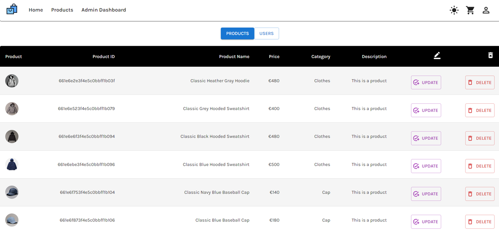

# Trending Shop

Trending Shop is a web application built with React that offers users an immersive online shopping experience. It sources product data from a custom backend API and provides features such as browsing products, managing the shopping cart, and user authentication.

Back-end Repository: [Back-end](https://github.com/Kudoo39/trending-api)

## Table of Contents

1. [Getting Started](#getting-started)
2. [Features](#features)
3. [Technologies Used](#technologies-used)
4. [Project Structure](#project-structure)
5. [Testing](#testing)
6. [Deployment](#deployment)
7. [Screenshots](#screenshots)

## Getting Started

To get started with the Trending Shop project, follow these steps:

1. Clone the repository: `git clone https://github.com/Kudoo39/trending`
2. Navigate to the project directory: `cd trending`
3. Install dependencies: `npm install` or `yarn install`
4. Run the app locally: `npm run start` or `yarn start`

## Features

- **Browse Products:** Explore a diverse selection of products sourced.
- **Search Functionality:** Find products quickly by searching with keywords or specific terms, improving navigation and user experience.
- **Product Details:** Access comprehensive information about each product, including name, price, description, and image.
- **Shopping Cart Management:** Add products to the shopping cart and easily manage cart items.
- **User Authentication:** Securely login and register accounts to access personalized features.
- **Demo Account:** Quickly explore the website's features without registering by logging in with a demo account.
- **Light-Dark Mode:** Customize users' browsing experience with the option to switch between light and dark themes.
- **Toast Notifications:** Receive instant feedback on actions or the status of operations through toast notifications.
- **Responsive Design:** Enjoy a seamless shopping experience across various devices with a responsive website design.

## Technologies Used

- TypeScript
- Redux Toolkit
- React
- Material UI

## Project Structure

```
src
 ┣ assets
 ┃ ┣ icons
 ┃ ┃ ┗ shop.svg
 ┃ ┗ images
 ┃ ┃ ┣ background.jpg
 ┃ ┃ ┣ cart_demo.png
 ┃ ┃ ┣ default_image.jpg
 ┃ ┃ ┣ homepage_demo.png
 ┃ ┃ ┣ login_demo.png
 ┃ ┃ ┣ no-product-cart.png
 ┃ ┃ ┣ products_demo.png
 ┃ ┃ ┗ responsive_demo.png
 ┣ components
 ┃ ┣ auth
 ┃ ┃ ┣ DemoAdminAccount.tsx
 ┃ ┃ ┗ DemoUserAccount.tsx
 ┃ ┣ categories
 ┃ ┃ ┗ Categories.tsx
 ┃ ┣ footer
 ┃ ┃ ┗ Footer.tsx
 ┃ ┣ modeToggle
 ┃ ┃ ┗ ModeToggle.tsx
 ┃ ┣ nav
 ┃ ┃ ┗ Nav.tsx
 ┃ ┣ product
 ┃ ┃ ┣ CreateProduct.tsx
 ┃ ┃ ┣ DeleteProduct.tsx
 ┃ ┃ ┗ UpdateProduct.tsx
 ┃ ┣ scrollUpButton
 ┃ ┃ ┗ ScrollUpButton.tsx
 ┃ ┣ search
 ┃ ┃ ┗ Search.tsx
 ┃ ┣ sortPrice
 ┃ ┃ ┗ SortPrice.tsx
 ┃ ┗ user
 ┃ ┃ ┣ UpdateAvatar.tsx
 ┃ ┃ ┣ UpdateEmail.tsx
 ┃ ┃ ┣ UpdatePassword.tsx
 ┃ ┃ ┗ UpdateUser.tsx
 ┣ config
 ┃ ┗ config.ts
 ┣ misc
 ┃ ┣ constants.ts
 ┃ ┗ type.ts
 ┣ pages
 ┃ ┣ Admin.tsx
 ┃ ┣ Cart.tsx
 ┃ ┣ Home.tsx
 ┃ ┣ Login.tsx
 ┃ ┣ ProductDetail.tsx
 ┃ ┣ Products.tsx
 ┃ ┣ Profile.tsx
 ┃ ┗ Register.tsx
 ┣ redux
 ┃ ┣ slices
 ┃ ┃ ┣ cartSlice.ts
 ┃ ┃ ┣ categorySlice.ts
 ┃ ┃ ┣ productSlice.ts
 ┃ ┃ ┗ userSlice.ts
 ┃ ┗ store.ts
 ┣ styled-components
 ┃ ┣ Box.ts
 ┃ ┣ Button.ts
 ┃ ┗ Card.ts
 ┣ test
 ┃ ┣ cart
 ┃ ┃ ┗ cartSlice.test.ts
 ┃ ┣ category
 ┃ ┃ ┗ categorySlice.test.ts
 ┃ ┣ product
 ┃ ┃ ┗ productSlice.test.ts
 ┃ ┗ user
 ┃ ┃ ┗ userSlice.test.ts
 ┣ utils
 ┃ ┣ checkImage.ts
 ┃ ┣ cleanImage.ts
 ┃ ┣ fetchData.ts
 ┃ ┗ sort.ts
 ┣ App.tsx
 ┣ index.css
 ┣ index.tsx
 ┣ react-app-env.d.ts
 ┣ reportWebVitals.ts
 ┣ setupTests.ts
 ┗ theme.ts
```

## Testing

1. Ensure all dependencies are installed: `npm install` or `yarn install`
2. Run the test suite: `npm run test` or `yarn test`

## Deployment

Check out the [Live Demo](https://integrify-trending.netlify.app/) to experience the E-Commerce Website in action.

## Screenshots

Here are some screenshots of the Trending Shop:

**Homepage:**


**Products Page:**


**Cart Page:**


**Login Page:**


**Responsive Design:**


**Admin Dashboard:**

